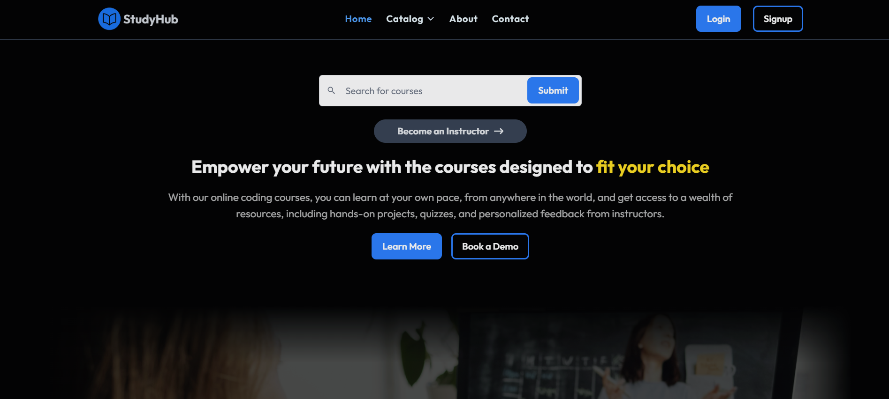
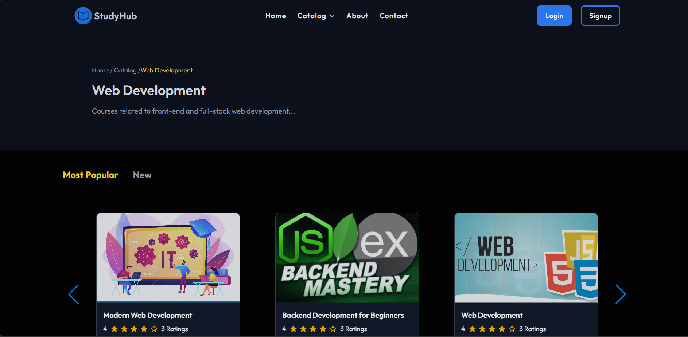
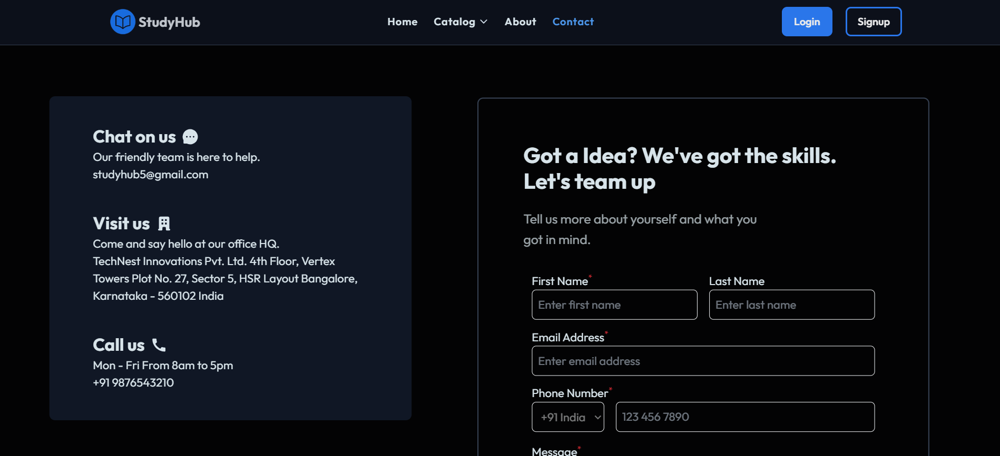
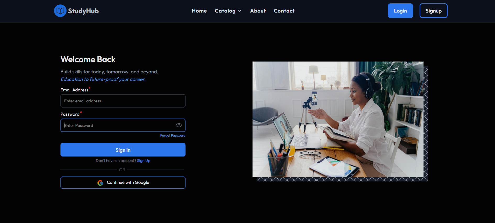
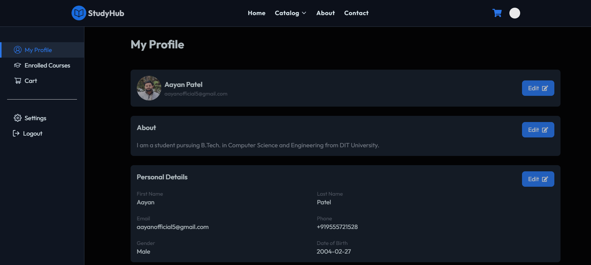
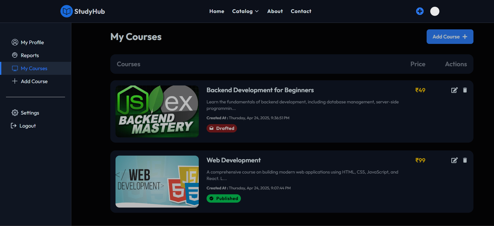
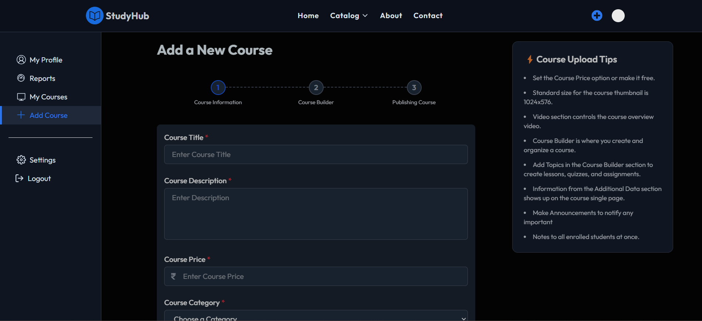

# 📚 StudyHub

> A Full Stack Online Learning Platform built with the MERN stack, enabling instructors to create and manage courses, and learners to access quality education from anywhere.

---

## 📝 Project Description

StudyHub is a fully functional ed-tech platform that enables instructors to create, manage, and deliver courses, and allows students to browse, enroll, and track their learning journey. The platform is built using the MERN stack (MongoDB, Express, React, Node.js) and aims to provide:

- A seamless and interactive learning experience for students, making education more accessible and engaging.
- A platform for instructors to showcase their expertise and connect with learners across the globe.

In the following sections, we will cover the technical details of the platform, including:

1. **System Architecture**: High-level overview of the platform's components.
2. **Front-end**: Description of the front-end architecture, UI design, features, frameworks, and tools.
3. **Back-end**: Description of the back-end architecture, features, frameworks, libraries, tools, data models, and database schema.
4. **API Design**: List of API endpoints, their functionalities, and sample requests and responses.
5. **Deployment**: Overview of the deployment process, hosting environment, and infrastructure.
6. **Testing**: Testing process, types, frameworks, and tools used.
7. **Future Enhancements**: Potential future improvements to the platform.

---

## 🏗️ System Architecture

StudyHub follows a client-server architecture, consisting of the following components:

### Front-end
The platform's frontend is built using React.js, providing a dynamic and responsive user interface. It communicates with the back end via RESTful APIs to handle user actions such as course browsing and enrollment.

### Back-end
Built with Node.js and Express.js, the back end serves APIs for functionalities such as user authentication, course management, and content delivery. The server logic handles the processing and storing of course data and user information.

### Database
MongoDB stores unstructured and semi-structured data, including course content (videos, PDFs, images) and user data. Its flexibility allows for easy scalability and efficient management of dynamic content.

### Architecture Diagram
Here is a high-level diagram that illustrates the architecture of the StudyHub ed-tech platform:


---

## 🌐 Live Demo

[🔗 Deployed Link (Coming Soon)](https://your-deployed-link.com)

---

## 🖼️ Screenshots

Here are some key screens from the project showcasing various pages and features:

### 🏠 Common Pages
- **Home Page**  
  

- **Catalog Filter Page**  
  

- **About Page**  
  

- **Contact Page**  
  

- **Login Page**  
  

- **Signup Page**  
  

- **User Dashboard**  
  

### 🎓 Instructor Interface
- **Instructor – Courses Overview**  
  

- **Instructor – Add New Course**  
  

---

## ✨ Features

### 👨‍🏫 Instructor Features
- Instructor Registration/Login
- Course creation with title, description, and video content
- Video uploads using Cloudinary
- Dashboard to manage courses and view enrolled students

### 👩‍🎓 Learner Features
- Student Registration/Login
- Browse and enroll in courses
- Stream course videos
- View enrolled courses and track progress

### 🔐 Common Features
- JWT-based authentication
- Role-based access control (Instructor & Student)
- Responsive and clean UI using Tailwind CSS
- Modular and scalable codebase

---

## 🛠️ Tech Stack

| Layer       | Tech Used                      |
|-------------|---------------------------------|
| Frontend   | React.js, Redux Toolkit, Tailwind CSS |
| Backend    | Node.js, Express.js             |
| Database   | MongoDB                         |
| Media Hosting | Cloudinary                   |
| Auth       | JWT, bcrypt                     |
| Dev Tools  | Postman, VS Code, GitHub        |

---

## 📁 Folder Structure

```
StudyHub/
├── Client/                           # Frontend React app
│   ├── .env                          # Environment variables (not pushed to Git)
│   ├── public/                       # Public assets (images, etc.)
│   └── src/                          # Source code
│       ├── assets/                   # Images, icons, etc.
│       ├── components/               # Reusable UI components
│       ├── pages/                    # Route-based page components
│       ├── services/                 # API services
│       └── data/                     # Data management (e.g., JSON files)
│    
├── Server/                           # Backend Express app
│   ├── .env                          # Environment variables (not pushed to Git)
│   ├── Configurations/                # Config files (e.g., DB, API settings)
│   ├── Controllers/                   # Route logic and handlers
│   ├── Extra/                        # Additional server files (scripts, etc.)
│   ├── Middlewares/                  # Express middleware
│   ├── Models/                       # Mongoose models
│   ├── Routes/                       # API route definitions
│   ├── Templates/                    # Email templates, etc.
│   └── utils/                        # Utility functions
├── Screenshots/                      # Screenshots for documentation
│   ├── common/                       # Common screenshots
│   ├── instructor/                   # Instructor-specific screenshots
│   └── student/                      # Student-specific screenshots
├── LICENSE                           # Project license
└── README.md                         # Main documentation file

```

---

## ⚙️ Getting Started

### 1. Clone the Repo

```bash
git clone https://github.com/aayanofficial5/StudyHub.git
cd StudyHub
```

---

### 2. Install Dependencies

```bash
# For frontend
cd Client
npm install

# For backend
cd Server
npm install
```

---

### 3. Set up Environment Variables

#### For the Backend:
Create a `.env` file inside the `/Server` folder with the following configuration:

```env
# Server Configuration
PORT=4000
BACKEND_URL=<your_backend_url_here>   # (e.g., http://localhost:4000/api/v1)
FRONTEND_URL=<your_frontend_url_here> # (e.g., http://localhost:5173)
DATABASE_URL=<your_database_connection_url_here>

# JWT Secret for Authentication
JWT_SECRET=<your_jwt_secret_here>

# Cloud Storage (e.g., Cloudinary) Configuration
CLOUD_NAME=<your_cloud_name_here>
API_KEY=<your_api_key_here>
API_SECRET=<your_api_secret_here>
FOLDER_NAME=<your_folder_name_here>

# Mail Service Configuration
MAIL_HOST=<your_mail_host_here>
MAIL_USER=<your_mail_user_here>
MAIL_PASS=<your_mail_password_here>

# Razorpay Payment Gateway Configuration
RAZORPAY_ID=<your_razorpay_id_here>
RAZORPAY_SECRET=<your_razorpay_secret_here>
```

#### For the Frontend:
Create a `.env` file inside the `/Client` folder with the following configuration:

```env
# Vite API URL (to connect with the backend API)
VITE_API_URL=<your_backend_url_here>   # (e.g., http://localhost:4000/api/v1)
```

---

### 4. Run the App

```bash
# Start backend in a terminal with the following commands:
cd Server
npm start

# Start frontend in another terminal with the following commands:
cd Client
npm start
```

---

## 💡 Future Improvements

- Payment Integration (Razorpay/Stripe)
- Certificate generation for course completion
- Search and filtering of courses
- Chat or forum feature for learners
- Admin dashboard for platform management

---

## 🤝 Contributing

Contributions, issues and feature requests are welcome!  
Feel free to check the [issues page](https://github.com/aayanofficial5/KnowGeek/issues).

---

## 📧 Contact

Developed with ❤️ by [**Aayan Patel**](https://github.com/aayanofficial5)  
📬 Email: *aayanofficial5@gmail.com*

---

## 📄 License

This project is licensed under the [MIT License](LICENSE).

---
